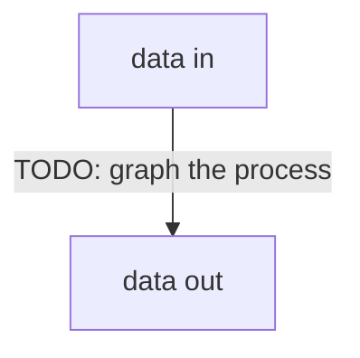

# Architecture

## `data.rs`
Meta target data-file representation, allowing for seamless integration with different file-types.

## `telegram.rs`
Always shows the markdown menu with the items at the currently selected level. At a click on each item we either change the position, either get a menu for changing its value.
